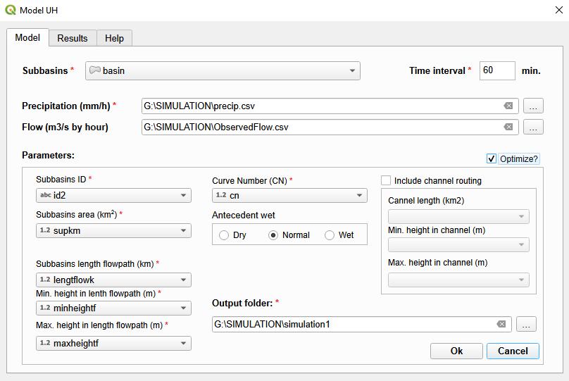
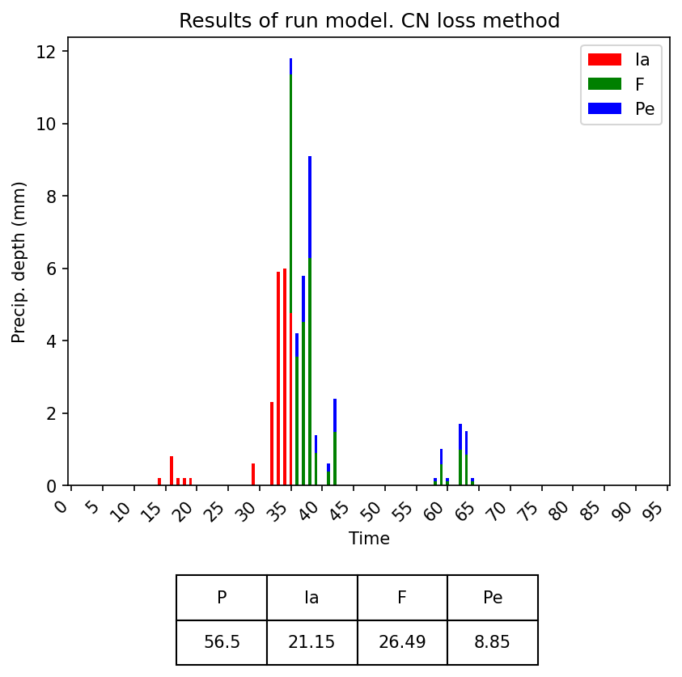
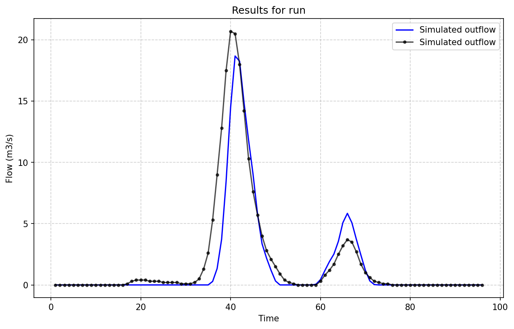
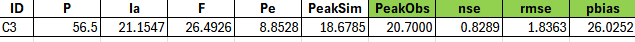
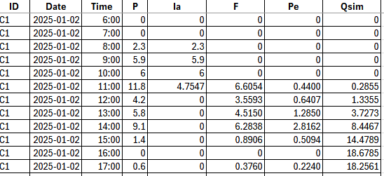
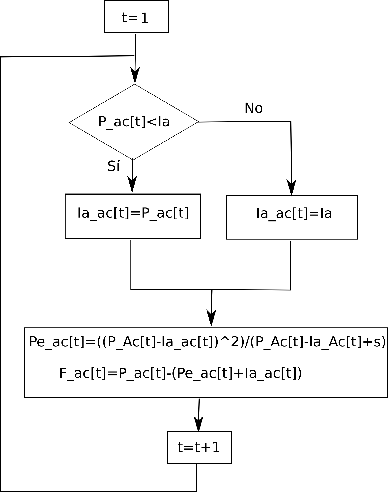

# hidroUH

Este plugin de QGIS permite estimar el caudal superficial generado por un evento de precipitación a nivel de cuenca (de forma agregada o mediante la esquematización de la cuenca en subcuencas). Para ello, utiliza el método del número del curva (CN) del Soil Conservation Service (SCS) para aproximar la fase de pérdidas (separación entre la Precipitación Neta (Pn) y la precipitación que no genera escorrentía superficial), el hidrograma unitario del SCS para conversión lluvia-escorrentía y el méteodo de Múskingum para la translación en cauce.

To report failures or make suggestions, please contact [fjgomariz@um.es](mailto:fjgomariz@um.es  "fjgomariz@um.es ") 

**Acknowledgments**: This work was supported by the Spanish Agencia Estatal de Investigación (Grant number TED2021-131131B-I00).


- **Autores**: [Francisco Gomariz-Castillo](), [Francisco Alonso-Sarría](https://github.com/pacoalonso/), Gabriel Molina-Pérez y Carmen Valdivieso-Ros
- **Version**: 0.1
- **Fecha**: 30 de Mayo de e2025

## 1. Plugin installation and requirements

Este plugin ha sido desarrollado utilizando [QGIS](https://www.qgis.org/en/site/forusers/download.html) 3.40 LTR.

###Instalación

Para instalar el plugin se debe descargar en formato zip desde [https://github.com/fdfsfjgomariz/hidroUH/](https://github.com/fdfsfjgomariz/hidroUH/):

1. En QGIS selecciona *Plugin -> Manage and Install Plugin ...*
2. Dentro de la ventana de gestión de plugin, se puede instalar el archivo descargado en formato zip desde e*Install from ZIP*.

Tras su instalación se puede acceder a través del menú Plugin (Fig.1) o con el botón de la barra de herramientas 


###Requeriments

El plugin ha sido desarrollado con Python 3.12. y requiere los siguientes paquetes:

- numpy
- pandas
- matplotlib
- math
- scipy

Después de la instalación del plugin, en caso de ser necesario, pueden instalarse desde la consola Python mediante ```pip```. Por ejemplo:

```shell script
python3 -m pip install numpy pandas matplotlib math tempfile scypy
```

## 2. Using plugin

La interfaz de usuario del plugin se divide en tres secciones: Model, donde se introducen los datos de entrada requeridos para su ejecución, Results, que muestra un resumen de los resultados (los resultados de detalle se generarán en el directorio de salida del plugin), y Help, con una manual de ayuda.

A sample dataset is available to test this plugin in archive [DataBasinParriel.zip](https://github.com/fdfsfjgomariz/hidroUH/test_datasets/DataBasinParriel.zip). El archivo contiene la siguiente información:

- ***basin.shp***: Layer en formato shapefile de la cuenca de la Rambla de Parriel, situada en el sureste de la Peníinsula Ibérica.
- ***precip.csv*** y ***ObservedFlow.csv***: Archivos con los datos tabulares horarios de precipitación y caudal observado en la desembocadura de la rambla.

En los siguientes subapartados se detalla la estructura de estos archivos.

### 2.1. Model (input data)

En la primera pestaña (Fig.1) se deben introducir los datos de entrada (el <span style=" color:#ff0000;"> *</span> indica que son obligatorios, mientras que el resto son optativos).



Los archivos de entrada con datos en forma de capa vectorial y/o serie temporal son:

- **Subbasins**: Layer tipo polígono cargado previamente en QGIS de la cuenca (o subcuencas). En esta capa se incluirán los parámetros en forma de columna, representando las características de éstas. Los elementos tipo *ComboBox* (listas deplegables) de la zona *Parameters* representan el nombre de las columnas que se introducirán como parámetros del modelo.
- **Time interval**: Intervalo de tiempo para el que generará la simulación (establecido en minutos). Debe coincidir con el paso de tiempo de los archivos de entrada y su rango operativo puede estar comprendido entre los 5 minutos y las 12 horas (720 minutos).  Por defecto se realizarán simulaciones con un paso de tiempo de 1 h (60 min.).
- **Precipitation (mm/h)**: Archivo tipo csv con la precipitación de entrada. El formato que debe tener es: Una primera columna almacenando la fecha y hora, y tantas columnas como subcuencas se quieran incluir en el modelo, incluyendo como nombre de éstas el código de la cuenca o subcuencas de la capa *Subbasins*, que almacenarán hietogramas asociados a cada subcuenca. Estos valores pueden obtenerse a partir de la estación meteorológica más cercana a cada subcuenca, una serie promedio obtenida de forma externa a partir de varios pluviógrafos o como una serie promedio obtenida a partir de datos en malla. El separador de columnas será *comma* y el símbolo decimal *point*. 
- **Flow (m<sup>3</sup>/s by hour)**: Archivo en formato csv con especificaciones similares al archivo de precipitación, que almacena el caudal observado en la desembocadura de la cuenca. Si se incluye este archivo, el plugin estimará la bondad de ajuste entre la simulación y el caudal observado y, en caso de activar el check box **Optimize?** realizar su calibración.

En cuanto a los parámetros requeridos, se incluyen los siguientes:

- **Subbasins ID**: Identificador (numérico o tipo texto) de cada subcuenca.
- **Subbasins area (km<sup>2</sup>)**: Superficie de la subcuenca ($km^2$).
- **Subbasins length flowpath (km)**: Longitud (km) de la línea de flujo máxima (o en su defecto del cauce principal) de la subuenca.
- **Min. height in lenth flowpath (m)** and **Max. height in length flowpath (m)**: Altitud máxima y mínima, expresada en metros, de la línea de flujo máxima (o en su defecto del cauce principal) de la subcuenca. Deben considerarse como la cota del final y del principio de dicha línea.
- **Curve Number (CN)**: Valor del número de curva medio de la subcuenca.
- **Antecedent wet** radio buttons: Opción que sirve para corregir el número de curva en función de las condiciones antecedentes de humedad en el suelo; por defecto se marca la opción *Normal*, que suele corresponder con los valores tabulados de número de curva y capas espaciales existentes.
- **Include channel routing** ckeck button: En caso de existir más de una subcuenca, esta opción sirve para indicar al plugin si se va a computar la translación en cauce; se debe tener en cuenta que la translación se producirá en las subsiguientes subcuencas aguas abajo de las subcuencas de cabecera, obteniendo como caudal final en sus salidas la suma del caudal generado en la subcuenca por la que transita más el caudal que llega tras transitar por el cauce considerado. Los parámetros a incluir en este caso son:
	- **Channel length (km)**: Longitud, expresada en km, del cauce asociado a la subcuenca por la que transitará el hidrograma que entra aguas arriba de la subcuenca.
	- **Min. height in channel (m)** and **Max. height in channel (m)**: Altitud máxima y mínima, expresada en metros, asociada a al cauce, considerara estas cotas como las asociadas al final y al principio del cauce. 

- **Output folder**: Directorio de salida en el que se almacenerá la información de detalle generada por el modelo (ver siguiente apartado).

### 2.2. Results

El plugin generará dos tipos de resultados: los incluidos en la pestaña **Results** y los que se generan y almacenan en el **Output folder**.

### 2.2.1. Pestaña *Results*

En esta pestaña se incluyen resultados de resumen para el conjunto de la simulación. Por un lado, se incluye por un lado una tabla con el resumen para todo el evento y la cuenca estudiada de la precipitación total acumulada (*P*), la infiltración inicial (*Ia*) y acumulada (*F*), la precipitación efectiva (*Pe*), y el caudal pico del evento simulado en la desembocadura de la cuenca (*PeakSim*). Además, si se ha incluido un archivo con el caudal observado, también incuirá como parte del resumen el pico del caudal observado (*PeakObs*), y los estadísticos de bondad de ajuste *nse*, *rmse* y *pbias* (en la [sección 3.4.](#3.4.-Model-performance-and-calibration) se definen estos estadísticos).

De forma complementaria, también incluye un gráfico con el hidrograma de caudal asociado a su salida; si se ha incluido un archivo de caudal observado, incorporará el caudal simulado (en color azul) y observado (en color negro).

### 2.2.2. Directorio *Output folder*

En este directorio se almacenan los resultados de detalle (gráficos y datos tabulares). Los gráficos generados son:

- **Fase de pérdidas: método del número de curva del SCS** (ver [sección 3.1.](#3.1.-Loss)): Se generará un gráfico por cada subcuenca representando el hietograma asociado al evento y su división en tres partes: (i) precipitación efectiva o neta (*Pe*), que generaría escorrentía superficial o directa, en color azul; las pérdidas o infiltración, divididas en  (ii) infiltración inicial antes de producirse escorrentía (abstracción inicial - Ia) en color rojo y (iii) la infiltración acumulada (infiltración que se produce al tiempo que se produce - Fa) en color verde. Además incluye un cuadro resumen para la subcuenca con los totales acumulados para el evento, incluyendo la precipitación total (P). En la siguiente figura se muestra un ejemplo.



- **Fase de transformación de lluvia-escorrentía: método del hidrograma unitario del SCS** (ver [sección 3.2.](#3.2.-Transform)): En este gráfico se resume para cada subcuenca el hidrograma de caudal asociado a su salida. En el caso de simulaciones para una sola cuenca, o para la subcuenca de salida con más de una subcuenca, si se incluye un archivo de caudal observado, además del caudal simulado (en color azul) se añadirá el caudal observado (en color negro); en la siguiente figura se incluye un ejemplo.



Añadido a estos gráficos, se generan dos archivos tabulares que almacenan los resultados numéricos:

- **model_resum.csv**: Archivo en formato csv con la misma configuración de los archivos de entrada (separadores de columnas, formatos, etc.). Incluye el resumen para todo el evento en cada subcuenca de la precipitación total acumulada (*P*), la infiltración inicial (*Ia*) y acumulada (*F*), la precipitación efectiva (*Pe*), y el caudal pico del evento simulado (*PeakSim*). En la siguiente tabla se muestra un ejemplo para la subcuenca que respresenta la salida; en este caso además, al incluirse un archivo de caudal observado en la simulación, se añadirá la siguiente información (encabezados resaltados en verde):  Caudal pico del caudal observado (*PeakObs*), y los estadísticos de bondad de ajuste *nse*, *rmse* y *pbias*.



- **model_results.csv**: Archivo en formato csv con la misma configuración de los archivos de entrada (separadores de columnas, formatos, etc.). Incluye, para cada paso de tiempo, el resultado de la simulación en cada subcuenca, incluyendo la separación de la precipitación en los diferentes componentes y el caudal resultante. En el caso de la subcuenca que representa la salida de la cuenca, el caudal será el asociado a toda el área estudiada. En la siguiente figura se incluye un ejemplo.



## 3. Methods

**hydroUH** es un plugin que permite aproximar mediante ecuaciones simples el comportamiento de un evento en lo relativo a la escorrentía directa que puede generar. Para ello, conceptualiza el sistema cuenca a partir de las fases descritas en las siguientes subsecciones, aplicando sus ecuaciones en cada subcuenca, de forma que el caudal que se vaya generando en cada subcuenca aguas arriba actuará como entrada en la subcuenca que tenga conectada aguas abajo. Puede por tanto concebirse como una implementación en red de una cuenca a partir de su división en recintos (subcuencas), que se conectan entre si desde aguas arriba (cuencas de cabecera para las que se implementan las ecuaciones de pérdidas y conversión lluvia-escorrentía a partir de modelos espacialmente agregados) con las subcuencas o recintos aguas abajo; la aproximación en este tipo de subcuencas o recintos se realizará de forma similar a las subcuencas de cabecera, pero además, el hidrograma simulado aguas arriba pasará a ser una entrada que transitará  en el cauce hasta que, al llegar a la desembocadura de dicha subcuenca, se sumará al hidrograma generado en ella.

Implementar este tipo de modelos permite una aproximación semidistribuida en el espacio a partir de los recintos, aproximando mejor la heterogeneidad espacial de aspectos como los usos del suelo, tipos de suelo o el comportamiento del propio evento a lo largo del tiempo y el espacio, pero utilizando ecuaciones para modelos simples espacialmente agregados. En la siguiente figura se incluye a modo de ejemplo el esquema de cuenca asociada a los archivos de ejemplo [DataBasinParriel.zip](https://github.com/fdfsfjgomariz/hidroUH/test_datasets/DataBasinParriel.zip), correspondiente a la Rambla de Parriel, ubicada en la Región de Murcia, al sureste de España. El esquema de cuenca se define a partir de tres subcuencas o recintos y el cauce para el que se estimará la translación del hidrograma procedente de las dos subcuencas de cabecera a la cuenca *C3*, que es el recinto al que se le asocia la salida de la cuenca.


### 3.1. Loss

El *número de curva* del U.S. Soil Conservation Service (SCS, 1985) es un método simple que permite separar de un hietograma de precipitación aquella parte que generará escorrentía directa, denominada precipitación eficaz o neta (*Pe*). Ha sido muy utilizado para estudiar episodios lluviosos en cuencas donde no se dispone de medidas de infiltración, obteniendo resultados que suelen ajustarse bien a los datos observados. Parte de las siguientes asunciones: El suelo retiene al principio una cierta cantidad de precipitación. Tras ello, las abstracciones van disminuyendo progresivamente; para ello, se parte del concepto de umbral de escorrentía *P0* (o abstracción inicial *Ia*) que depende de la textura del suelo, el uso del suelo y y su manejo, normalmente dependiente de la pendiente. Este valor depende a su vez del parámetro adimensional número de curva (NC), que varía entre 0 (no existe infiltración) y 100 (infiltración máxima).

Para realizar la separación, se utiliza el parámetro denominado *Infiltración Potencial Máxima* ***S***, abstracción máxima posible (suele asumirse que *P0* es el 20% de *S*). Puede estimarse a partir de la siguiente ecuación:

$$
S=\frac{25400}{NC} - 254
$$

NC puede obtenerse a partir de las tablas del SCS (1985), para lo cuál es necesario (a) disponer de valores de textura, lo que permite (b) obtener los grupos hidrológicos del suelo, y (c) disponer de información de coberturas de usos del suelo y pendientes. Como alternativa, existen diferentes aproximaciones basadas en coberturas del uso del suelo o aproximaciones obtenidas espacialmente distribuidas. Por ejemplo, en el caso de España, la [**Norma 5.2-IC de Drenaje Superficial de la Instrucción de Carreteras (2016)**](https://cdn.mitma.gob.es/portal-web-drupal/carreteras/52ic_fom2982016_err_fom1852017_res180326_consolidado.pdf) tabula para Corine Land Cover diferentes valores de NC asociados a diferentes tipos de cobertura de usos del suelo, y el [**Ministerio para la Transición Ecológica y el Reto Demográfico**](https://www.miteco.gob.es/es/agua/temas/gestion-de-los-riesgos-de-inundacion/snczi/mapa-de-caudales-maximos.html) ha aproximado para toda España valores de *P0* a partir de los que se pueden derivar valores de NC.

Los NC aproximados a partir de las tablas son valores para condiciones de humedad antecedente no conocida o con un valor de humedad intermedio. Si se conocen las condiciones antecedentes de humedad, NC debe corregirse utilizando las siguientes ecuaciones, la primera de ellas si las condiciones de los días precedentes fueron secas (**METE REFERENCIA**) y la segunda si las condiciones precedentes fueron húmedas **METE REFERENCIA**:

$$
NC=\frac{4.2 \cdot NCt}{10 - 0.058 \cdot NC_t}
$$

$$
NC=\frac{23 \cdot NCt}{10 + 0.13 \cdot NC_t}
$$

siendo $NC_t$ el valor obtenido para condiciones de humedad no conocida o con un valor intermedio.

Obtenida *S*, el resto de los componentes pueden aproximarse a partir de las siguientes ecuaciones:

- ***Ia***: Infiltración inicial antes de que se produzca escorrentía directa:

$$
Ia=0,2 \cdot S
$$

- ***Pe***: Precipitación efectiva, parte de la precipitación que genera escorrentía directa:

$$
Pe=\frac{(P- 0,2 \cdot S)^2}{P + 0.8 \cdot S}
$$

- ***Fa***: Infiltración acumulada o infiltración que se produce al mismo tiempo que la escorrentía: 

$$
Fa = P - Pe - Ia
$$

A partir de las ecuaciones anteriores pueden aproximarse los diferentes componentes de forma temporalmente distribuida; en la siguiente figura se reprenta el esquema conceptual del proceso de cálculo para cada paso de tiempo *t*:



### 3.2. Transform

Una vez dividido los componentes de la precipitación y estimada *Pe* en cada subcuenca, el plugin realiza su conversión a escorrentía a partir del hidrograma unitario del SCS (SCS, 1986) a partir de las características de la cuenca y su convolución para la *Pe* estimada previamente. Para ello, el plugin estima en primer lugar el hidrograma  sintético triangular del SCS (1986), aproximación sencilla basada en los tiempos característicos de las subcuencas y su caudal pico:

- El tiempo al pico ***Tp*** (horas) puede estimarse a partir del tiempo de ratardo *Tlag*, que expresa el tiempo transcurrido entre el centro de masa de *Pe* y el caudal pico *Qp*. La aproximación utilizada en el plugin para aproximar *Te* es la propuesta por Chow (1994) y Natural Resources Conservation Service (1999), que utiliza la duración de *Pe* (en el caso del hidrograma unitario será una duración unidad):
$$

Tp= \frac{Te}{2} + Tlag \approx \frac{Te}{2} + 0.6 \cdot Tc
$$

- El tiempo de concentración ***Tc*** (horas) es el tiempo que tarda la última gota de lluvia caída en el punto más alejado de la cuenca a la desembocadura en llegar a ésta. En el plugin se ha implementado la ecuación propuesta por Témez (1987), que requiere conocer la longitud *L* (km) de la línea de flujo máxima de la subcuenca (longitud del cauce principal hasta la divisoria de aguas) y la pendiente media del cauce principal *S*, expresada en tantos por uno:

$$
	Tc= 0.3 \cdot \Big(\frac{L}{S^{0.25}}\Big)^{0.76}
$$

- El caudal pico ***Qp*** ($m^3/seg$) puede obtenerse a partir de *Tp* y el áera de la subcuenca ($km^2$) mediante la siguiente expresión

$$
	Qp = \frac{0.208 \cdot A}{Tp} 
$$

- El tiempo de base ***Tb*** o tiempo de duración (horas) de la escorrentía directa puede obtenerse a partir de la siguiente expresión:

$$
	Tb = 2.67 \cdot Tp
$$

El problema del hidrograma sintético triangular del SCS (1986) es que no representa bien la forma de un hidrograma. Para ello, en el plugin se ha utilizado, a partir de éste, el hidrograma adimensional del SCS (1986) en la forma estandar PRF-484 (SCS, 1986; USACE, 2025)**. A partir de éste es posible generar el hidrograma de caudal para cualquier *Pe* a partir de su convolución.

### 3.3. Routing

Si bien los dos procesos anteriores se realizan para cada subcuenca de forma independiente, implementar este tipo de esquemas en red implica conectar los diferentes hidrogramas generados con las subcuencas aguas abajo, de forma que al hidrograma generado en dicha subcuenca se le agregue el hidrograma generado aguas arriba de ésta. Por ello, es necesario considerar la translación de los hidrogramas dentro de las subcuencas.

En el plugin se implementa la versión de Muskingum de USACE (2025), Método hidrológico basado en el concepto de embalse para simular la propagación y atenuación del hidrograma mediante la ecuación de continuidad. Parte de la suposición de la no existencia de pérdida de volumen por infiltración o evaporación, por lo que el área del hidrograma final será igual al de inicio y su forma y retardo será función del recorrido. 

Requiere de dos parámetros:

- ***K*** (horas): Tiempo entre los centros de masa de los hidrogramas de entrada y salida (controla el desplazamiento del hidrograma). Una primera aproximación puede estimarse a partir de la ecuación propuesta por Chow (1994) $K = 0.6 * Tc$, estimando *Tc* a partir de la longitud y pendiente del cauce por el que se produce el tránsito del hidrograma.
- ***X***, que controla la forma al recorrer el tramo (controla la forma). Puede variar entre 0 (translación del hidrograma sin atenuación) y 0.5 (atenuación máxima del hidrograma), aunque suelen establerse valores entre 0.2 (cauces con poca pendiente) y 0.3 (cauces con pendiente elevada).


### 3.4. Model performance and calibration

En caso de disponer de datos de caudal observado (*Qobs*) en la salida de la cuenca, el plugin permite comparar los resultados obtenidos por el modelo (*Qsim*). Para ello utiliza los siguientes estadísticos de bondad de ajuste, desarrollados en detalle en Moriasi et al. (2015):

- Nash & Sutcliffe (1970) efficiency index ***nse***, is a dimensionless index with a similar interpretation to $R^2$, but more robust to the problems of the latter, such as sensitivity to extreme biases and insensitivity to constant biases (additive or multiplicative). Puede estimarse a partir de la siguiente ecuación:

$$
	nse = 1 - \frac{\sum^{n}_{i=1}\left(Qobs_i - Qsim_i\right)^2}{\sum_{i=1}^{n} \left(Qobs_i - \overline{Qobs}\right)^2}
$$

- Root mean square error  ***rmse***. Is a measure of absolute error (in the same units as the variable under consideration) that measures the difference between the values predicted by a model and the actual observed values; it ranges from 0 (perfect fit) to $+ \infty$ (high error). Puede estimarse a partir de la siguiente ecuación:

$$
	rmse = \sqrt{\frac{\sum^{n}_{i=1}\left(Qobs_i - Qsim_i\right)^2}{n}}
$$

- Percent bias ***pbias***, measures the average tendency of the simulated data to be larger or smaller than their reference values. Positive values indicate underestimation and negative values indicate overestimation. Puede definirse como:

$$
	Pbias = \frac{\sum_{i=1}^{n} \left(y_{obs,i} - y_{sim,i}\right)}{\sum_{i=1}^{n} y_{obs,i}} \cdot 100
$$

En lo referente a la calibración del modelo, en caso de seleccionar esta opción y disponer de datos de caudal observado, el plugin incorpora la optimización a partir del algoritmo disponible en ScyPy [L-BFGS-B](https://docs.scipy.org/doc/scipy/reference/optimize.minimize-lbfgsb.html) (Zhu et al., 1997), a quasi-Newton method for solving large nonlinear optimization problems with bounds on the variables.

El plugin trata de ajustar el  modelo modificando los prámetros de todas las subcuencas de *NC* (valor de entrada en el plugin) y los parámetros que calcula de forma interna a partir de *Tc*, tanto para las subcuencas como para los cauces en caso de existir translación; en este último caso calibra también el valor del parámetro *X* de Muskingum. No es necesario incluir las horquillas de calibración, que son fijadas a priori en el plugin.

Como función objetivo *F0*, en esta primera versión experimental del plugin se ha optado por utilizar efficiency index *nse*, de forma que el problema pasa a ser de maximización de este estadístico de bondad de ajuste.

## References

- Chow, V. T. (1994). *Hidráulica de canales abiertos* (Traducción). Santafé de Bogotá, Colombia: McGraw-Hill Interamericana S.A.

- Moriasi, D. N., Gitau, M. W., Pai, N., & Daggupati, P. (2015). Hydrologic and water quality models: Performance measures and evaluation criteria. *Transactions of the ASABE*, 58(6), 1763–1785. https://doi.org/10.13031/trans.58.10715

- Nash, J. E., & Sutcliffe, J. V. (1970). River flow forecasting through conceptual models part I — A discussion of principles. *Journal of Hydrology*, 10(3), 282–290. https://doi.org/10.1016/0022-1694(70)90255-6

- SCS (1985). Section 4: Hydrology. In *National Engineering Handbook*. Washington D.C.: US Department of Agriculture, Soil Conservation Service, Engineering Division.

- SCS (1986). Urban Hydrology for Small Watersheds TR-55. Washington D.C.: US Department of Agriculture, Soil Conservation Service, Engineering Division.

- Témez, J.R. (1978). *Cálculo hidrometeorológico de caudales máximos en pequeñas cuencas naturales*. Madrid, Spain: M.O.P.U. Dirección General de Carreteras. Madrid.

- USACE. (2025). *Hydrologic Modelling System HEC-HMS. Technical Reference Manual*.

- Zhu, C., Byrd, R. H., Lu, P., & Nocedal, J. (1997). Algorithm 778: L-BFGS-B. *ACM Transactions on Mathematical Software*, 23(4), 550–560. https://doi.org/10.1145/279232.279236

### License

[hydroUH](https://github.com/fdfsfjgomariz/hidroUH) © 2025 by [Francisco Gomariz-Castillo](https://portalinvestigacion.um.es/investigadores/333183/detalle) is licensed under [CC BY-NC 4.0](https://creativecommons.org/licenses/by-nc/4.0/)
