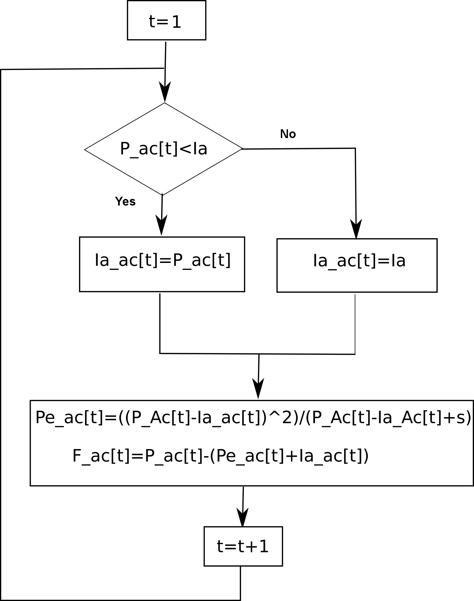

# hidroUH


This QGIS plugin can be used to estimate the surface flow generated by a precipitation event at the watershed scale, either in an aggregated mode or by dividing the watershed into subwatersheds. It uses the curve number (CN) method of the Soil Conservation Service (SCS) to approximate the separation between net precipitation (Pn) and precipitation that does not generate surface runoff), the SCS unit hydrograph for rainfall–runoff conversion, and the Muskingum method for water in-channel routing.

To report failures or make suggestions, please contact [fjgomariz@um.es](mailto:fjgomariz@um.es  "fjgomariz@um.es ") 

**Acknowledgments**: This work was supported by the [Grant TED2021-131131B-I00] funded by MICIU/AEI/
10.13039/501100011033 and by the European Union NextGenerat onEU/PRTR.


- **Authors**: [Francisco Gomariz-Castillo](https://github.com/fdfsfjgomariz/), [Francisco Alonso-Sarría](https://github.com/pacoalonso/), Gabriel Molina-Pérez and [Carmen Valdivieso-Ros](https://github.com/mcarmenvaldivieso)
- **Version**: 0.1
- **Date**:  May 30 2025

## 1. Plugin installation and requirements

This plugin has been developed using [QGIS](https://www.qgis.org/en/site/forusers/download.html) 3.40 LTR.

### Installation

 To install the plugin, download it in ZIP format from [https://github.com/fdfsfjgomariz/hidroUH/](https://github.com/fdfsfjgomariz/hidroUH/):

1. In the QGIS GUI, select *Plugins -> Manage and Install Plugin* from the Menu bar .

2. In the open dialog box, select *Install from ZIP*.

3. Use the provided selector widget to select the downloaded zip file on your device.

4. Click in the *Install Plugin* button below.

 After installation, the plugin can be accessed via the *Plugins* menu (Fig. 1) or the toolbar button  

<div align="center"></div>

### Requeriments

The plugin has been developed with Python 3.12. and requires the following packages: 

- numpy
- pandas
- matplotlib
- scipy

If necessary, the packages can be installed from the Python console using *pip* after installation. For example:
 
```shell script
python3 -m pip install numpy pandas matplotlib scipy
```

## 2. Example of use

To follow this tutorial, download the available sample dataset [DataBasinParriel.zip](https://github.com/fdfsfjgomariz/hidroUH/test_datasets/DataBasinParriel.zip), which correspond to the Rambla de Parriel in the Region of Murcia, south-eastern Spain. The basin scheme is based on three sub-basins and their channels. The translation of the hydrograph from the two headwater sub-basins to the catchment area C3, which is the catchment area associated with the basin outlet, will be estimated.

This file contains data for aggregated basin:

- A shapefile polygon layer of the Rambla de Parriel watershed (SE Spain): ***basin.shp***
- Two files with hourly precipitation and runoff data observed in the Rambla outlet in CSV format: ***AGprecip.csv*** and ***AGObservedFlow.csv***

This file contains data for a sub-basin model implementation:

- A shapefile polygon layer of 3 sub-basins in the Rambla de Parriel watershed (SE Spain): ***subbasin.shp***
- Two files with hourly precipitation for 3 sub-basins and runoff data observed in the Rambla outlet in CSV format: ***DISTprecip.csv and DISTObservedFlow.csv***

There are three tabs on the plugin dialog: 

1. 'Model': the input data required must be entered in this section. 
2. 'Results': shows a summary of the results (detailed results will be generated in the plugin output directory). 
3. 'Help': contains the plugin manual.
 
### 2.1. Model tab

To start the process, enter the input data using the first tab as in Fig. 1. Please note that fields marked with an asterisk (<span style=" color:#ff0000;"> *</span>) are required to run the model.

<div align="center"></div>

- **Subbasins** (<span style=" color:#ff0000;">required</span>): Select on the drop-down menu the polygon layer with the basin (or subbasins) shapefile. It must have been previously loaded as a layer in QGIS canvas. 

- **Time interval** (<span style=" color:#ff0000;">required</span>): Time interval in minutes for which the simulation will be generated. It must coincide with the time step of the input files. Its operating range goes from 5 minutes to 720 minutes. By default, the time step is set to 60 min.

- **Precipitation (mm/h)** (<span style=" color:#ff0000;">required</span>): Use the file selector widget to import the CSV file with the precipitation data. This file must contain a first column with a sequential unique identifier for each observation, the second and third columns with date and time data, and as many columns as sub-basins to be included in the model, named with the same identifier of basin or sub-basins in the *Subbasins* layer attibute table. The columns of this csv file must be separated by comma (",") and use the point (".") as the decimal symbol, and store the values from the hyetographs associated with each sub-basin at (or below) the time step of interest (previously obtained by the user from the closest weather station, or from an average series from several rain gauges or gridded data). 

- **Flow (m<sup>3</sup>/s by hour)** (optional): Use the file selector widget to import the CSV file (with the same specifications as the precipitation file) storing the flow observed at the mouth of the basin to estimate the goodness of fit between the simulation and the observed flow and calibrate, if the **Optimize?** check box is selected. The columns included are the same as in the precipitation file but the single flow column will be named according to the name of the basin to which it is associated.

- **Parameters** box. Most of them correspond to columns needed in the spatial layer of hydrological basins:

	- **Subbasins ID** (<span style=" color:#ff0000;">required</span>): Use the drop-down menu to select the column in the attribute table with the identifier of each sub-basin (it could be either numeric or character).
	- **Subbasins area (km<sup>2</sup>)** (<span style=" color:#ff0000;">required</span>): Use the drop-down menu to select the column in the attribute table containing the area of the sub-basin ($km^2$).
	- **Subbasins length flowpath (km)** (<span style=" color:#ff0000;">required</span>): Use the drop-down menu to select the column in the attribute table containing the length (km) of the maximum flow line (or the main channel) of the sub-basin.
	- **Min. height in lenth flowpath (m)** (<span style=" color:#ff0000;">required</span>) and **Max. height in length flowpath (m)** (required): Use the drop-down menus to select the column in the attribute table containing the maximum and minimum altitudes, expressed in metres, of the line of maximum flow (or, in its absence, of the main channel) of the sub-basin (i.e. the elevations of the beginning and end of this line).
	- **Curve Number (CN)** (<span style=" color:#ff0000;">required</span>): Use the drop-down menu to select the column in the attribute table containing the average curve number of the sub-basin.
	- **Antecedent wet** radio buttons (<span style=" color:#ff0000;">required</span>): Option to adjust the curve number according to background soil moisture conditions. By defalult, it is set to *Normal*, usually corresponding to the curve number values in the existing spatial layers and the tabulated values.

	- **Include channel routing** ckeck button (optional): If there is more than one sub-basin, this option indicates to the plugin whether the translation in the riverbed should be computed. It should be noted that the translation will take place in subsequent sub-basins downstream of the headwater sub-basins. The final flow at the outlets is the sum of the flow generated in the sub-basin through which it transits, plus the flow arriving after transiting through the considered riverbed. The values included in the columns will depend on whether or not routing is considered in the sub-basin: in an aggregated model scheme it is not considered (the value included will be null), while if the scheme is composed of sub-basins, in those for which routing is not considered (headwater sub-basins) the cell will be left blank, including values for the sub-basins in which routing occurs. The parameters to be included in this case are:
		- **Channel length (km)**: Use the drop-down menu to select the column in the attribute table containing the length, expressed in km, of the channel associated with the sub-basin through which the hydrograph entering upstream of the sub-basin will flow.
		- **Min. height in channel (m)** and **Max. height in channel (m)**: Use the drop-down menus to select the columns in the attribute table containing the maximum and minimum altitude, expressed in metres, associated with the watercourse, these altitudes are considered to correspond to the end and the beginning of the watercourse.

	- **Output folder** (<span style=" color:#ff0000;">required</span>): Use the selector widget to select the output directory to save the detailed information generated by the model (see next section).


In addition to the parameters defined above in the polygon layer as columns, a last column must be included to define the conceptual scheme (network) of the basin. This column (in the two example layers it is called ***Downstream***) defines the connections between each sub-basin with respect to the downstream sub-basin. To understand the process, an example of a connection to represent the Parriel basin is shown in figure (this represent scheme for figure in section 3). Two headwater sub-basins (C1 and C2) are defined that connect downstream with sub-basin C3. Therefore, the resulting hydrograph in C3 will not be the one generated in it, but its sum plus the inflow hydrographs of C1 and C2, which will also pass through a channel until reaching the outlet of C3.

<div align="center"></div>


### 2.2. Results tab

The results will be shown in two different ways: displayed in the **Results** tab, and stored in the **Output folder**.

### 2.2.1.  *Results*
 
It provides with:

- A tabular summary of form of the overall simulation results, including the total accumulated precipitation (*P*), the initial (*Ia*) and accumulated infiltration (*F*), the effective precipitation (*Pe*), and the peak flow of the simulated event at the mouth of the basin (*PeakSim*) for the whole event and the studied basin. If an observed flow file has been included, the summary will also include the peak observed flow (*PeakObs*) and the goodness-of-fit statistics *nse*, *rmse* and *pbias* (defined in [section 3.4.](#3.4.-Model-performance-and-calibration)). 

- A graph of the associated flow hydrograph (output associated to basin in aggregated model or the output associated with the last sub-basin). If an observed flow file has been included, both the simulated (blue line) and the observed (black line) flow hydrographs will be dispayed.

<div align="center"></div>

### 2.2.2. *Output folder*

This folder stores the detailed results (plots and tabular data). The produced plots are:

- **Losses phase: SCS curve number method** (see [section 3.1.](#3.1.-Loss)): It generates one graph for each sub-basin, representing the histogram associated with the event, divided into three parts: (i) Effective or net precipitation (*Pe*), which generates surface or direct runoff (blue). (ii) Initial infiltration before runoff occurs (initial abstraction – *Ia*)(red) . (iii) Accumulated infiltration (infiltration occurring at the time it occurs – *Fa*)(green). A summary table for the sub-basin is also included, showing the cumulative totals for the event, including total precipitation (*P*). The figure below shows an example.

<div align="center"></div>


- **Rainfall-runoff transformation phase: SCS unit hydrograph method** (see [section 3.2.](#3.2.-Transform)): 
This graph summarises the flow hydrograph associated with the outflow of each sub-basin. For simulations involving a single basin or an output sub-basin comprising multiple sub-basins the observed flow (in black) will also be added if an observed flow file is included alongside the simulated flow (in blue). An example is provided in the figure below.

<div align="center"></div>

Besides, the outcome values are gathered in two tabular files:

- **model_summary.csv**:  CSV file with the same format as the input files (column separators, formats, etc.). It includes a summary of the total accumulated precipitation (*P*), initial infiltration (*Ia*) and accumulated infiltration (*F*), effective precipitation (*Pe*) and peak flow of the simulated event (*PeakSim*) for each sub-basin of the event. The following table shows an example of the output for a sub-basin. In this case, when an observed flow file is included in the simulation, the following additional information is added (headings highlighted in green): Peak flow of the observed flow (PeakObs), and the goodness-of-fit statistics *nse*, *rmse* and *pbias*. 


<div align="center"></div>

- **model_results.csv**: CSV file with the same format as the input files (column separators, formats, etc.). For each time step, it includes the simulation results for each sub-basin, including the separation of precipitation into its different components and the resulting flow. For the sub-basin representing the basin outlet, the flow will correspond to that of the entire studied area. An example is provided in the figure below.
 

<div align="center"></div>

## 3. Methods

**hydroUH** is a plugin that approximates the behaviour of a rainfall event in terms of direct runoff using simple equations. It conceptualises the basin system in terms of the phases described in the following subsections and applies its equations to each sub-basin. The flow generated in each upstream sub-basin acts as input to the downstream sub-basin. Therefore, it can  be conceived as a network implementation of a basin based on its division into sub-basins connected to each other from upstream (headwater basins, for which loss and rainfall-runoff conversion equations are implemented from spatially aggregated models), as well as to sub-basins or sub-basins downstream. The approximation in these sub-basins  is carried out similarly to that in the headwater sub-basins. Additionally, the simulated upstream hydrograph becomes an inflow that travels in the channel until it reaches the mouth of the sub-basin. There, it is added to the hydrograph generated in the sub-basin.

Implementing these models provides a semi-distributed spatial approximation, which better approximates the spatial heterogeneity of land use or soil types, as well as the behaviour of events over time and space, while using equations for simple, spatially aggregated models. 

The following figure shows the watershed scheme associated with the example files  [DataBasinParriel.zip](https://github.com/fdfsfjgomariz/hidroUH/test_datasets/DataBasinParriel.zip), which correspond to the Rambla de Parriel in the Region of Murcia in south-eastern Spain. The basin scheme composed of three sub-basins and their channels. The translation of the hydrograph from the two headwater sub-basins to the catchment area *C3*, which is the catchment area associated with the basin outlet, will be estimated.


<div align="center"></div>


### 3.1. Loss

 The *curve number* method, developed by the U.S. Soil Conservation Service (SCS, 1985), is a simple way to determine the part of a rainfall histogram that will generate direct runoff, known as effective or net precipitation (*Pe*). It has been widely used to study rainfall events in catchments where infiltration measurements are unavailable, producing results that closely match the observed data. The method is based on the following assumptions: The soil initially retains a certain amount of precipitation. After that, the abstraction progressively decreases. For this purpose, the concept of a runoff threshold (*P0*) (also called initial abstraction - *Ia*) is assumed. This value depends on soil texture, land use and management, and is usually slope-dependent. These factors are integrated into a single number: the dimensionless parameter curve number (*CN*), which varies between 0 (no infiltration) and 100 (maximum infiltration).


To separate infiltration and runoff, the so called *maximum potential infiltration* parameter ***S*** can be estimated using the following equation:

$$
S=\frac{25400}{CN} - 254
$$


NC can be obtained from the SCS (1985) tables. To do so, it is necessary to have texture values, which allow the hydrological soil groups to be obtained, as well as land use cover and slope information. Alternatively, there are different approximations based on land use coverage or spatially distributed approximations. For example, in the case of Spain, [**Norma 5.2-IC de Drenaje Superficial de la Instrucción de Carreteras (2016)**](https://cdn.mitma.gob.es/portal-web-drupal/carreteras/52ic_fom2982016_err_fom1852017_res180326_consolidado.pdf) tabulates different *CN*  values for Corine land cover classes. [**Ministerio para la Transición Ecológica y el Reto Demográfico**](https://www.miteco.gob.es/es/agua/temas/gestion-de-los-riesgos-de-inundacion/snczi/mapa-de-caudales-maximos.html) has approximated for the whole of Spain values of *P0* from which *CN* values can be derived.


The *CN*  values approximated from the tables are for either unknown antecedent moisture conditions or intermediate moisture values. If the antecedent moisture conditions are known, the *CN* must be corrected using the following equations: the first if the conditions were dry and the second if the conditions were wet (Chow et al., 1994).

$$
NC=\frac{4.2 \cdot NCt}{10 - 0.058 \cdot NC_t}
$$

$$
NC=\frac{23 \cdot NCt}{10 + 0.13 \cdot NC_t}
$$


where $NC_t$ is the value obtained for conditions of unknown humidity or with an intermediate value.

Once *S* is obtained, the remaining components can be approximated from the following equations:

- ***Ia***: Initial infiltration before direct runoff occurs:

$$
Ia=0,2 \cdot S
$$

- ***Pe***: Effective precipitation, the fraction of precipitation that generates direct runoff:

$$
Pe=\frac{(P- 0,2 \cdot S)^2}{P + 0.8 \cdot S}
$$

- ***Fa***: Cummulative infiltration, which occurs at the same time as runoff:


$$
Fa = P - Pe - Ia
$$

The different components can be approximated in a temporally distributed manner using the above equations. The following figure represents the conceptual scheme of the calculation process for each time step *t*:

<div align="center"></div>


### 3.2. Transform

Once the precipitation components have been divided and *Pe* has been estimated for each sub-basin, the plugin converts them to runoff using the SCS (1986) unit hydrograph, based on the basin's characteristics and the convolution of the previously estimated Pe. First, the plugin estimates the synthetic triangular SCS (1986) hydrograph, a simple approximation based on the sub-basins' characteristic times and peak flow.

- The time to peak ***Tp*** (hours) can be estimated from the lag time *Tlag*, which expresses the time between the centre of mass of *Pe* and the peak flow (*Qp*). The plugin uses the approximation proposed by Chow (1994) and the Natural Resources Conservation Service (1999) to estimate *Te*, which uses the duration of *Pe* (in the case of the unit hydrograph, this will be a unit duration).


$$
Tp= \frac{Te}{2} + Tlag \approx \frac{Te}{2} + 0.6 \cdot Tc
$$

- The time of concentration ***Tc*** (hours) is the time it takes for the last raindrop falling at the furthest point of the catchment to reach the outfall. The plugin implements the equation proposed by Témez (1987), which requires the length *L* (in km) of the maximum flow line of the sub-basin (i.e. the length of the main channel to the watershed) and the average slope *S* of the main channel, expressed as the tangent of the slope.

$$
	Tc= 0.3 \cdot \Big(\frac{L}{S^{0.25}}\Big)^{0.76}
$$

  The peak flow ***Qp*** ($m^3/sec$) can be obtained from *Tp* and the sub-basin area *A* ($km^2$) using the following expression:

$$
	Qp = \frac{0.208 \cdot A}{Tp} 
$$

- The base time ***Tb*** or duration time (hours) of direct runoff can be obtained from the following expression:

$$
	Tb = 2.67 \cdot Tp
$$
 
The problem with the synthetic triangular hydrograph of the SCS (1986) is that it does not accurately represent the shape of a hydrograph. Therefore, the plugin uses the dimensionless hydrograph in the standard PRF-484 form (SCS, 1986; USACE, 2025). It is then possible to generate the flow hydrograph for any *Pe* from its convolution.

### 3.3. Routing

The previous two processes are carried out independently for each sub-basin, and the hydrographs produced have to be connected to the downstream subbasin. This means that the hydrograph generated in a sub-basin is added to the hydrograph generated upstream of it. Therefore, the translation of the hydrographs within the sub-basins must be considered.


The plugin implements the Muskingum version of the USACE method (USACE, 2025), which is a hydrological method based on the reservoir concept that simulates the propagation and attenuation of the hydrograph using the continuity equation. The method assumes that there is no volume loss through infiltration or evaporation. This means that the area of the final hydrograph will be equal to that at the start, and its shape and delay will be a function of the path.

It requires two parameters:

- ***K*** (hours): The time between the centres of mass of the inflow and outflow hydrographs (this controls the displacement of the hydrograph). An initial estimate can be obtained using the equation proposed by Chow (1994): $K = 0.6 \cdot Tc$, where *Tc* is estimated from the length and slope of the channel through which the hydrograph passes.

- ***X*** controls the shape of the hydrograph as it travels through the reach. It can vary between 0 (no hydrograph attenuation) and 0.5 (maximum hydrograph attenuation), although values between 0.2 (low-gradient streams) and 0.3 (steeply-graded streams) are usually set.


### 3.4. Model performance and calibration


If observed flow data (*Qobs*) are available at the basin outlet, the plugin enables to compare them with the results obtained by the model (*Qsim*). The following goodness-of-fit statistics, which are discussed in detail by Moriasi et al. (2015), are used:

- The Nash and Sutcliffe efficiency index ***nse*** is a dimensionless index with a similar interpretation to R², but more robust to problems such as sensitivity to extreme biases and insensitivity to constant biases (additive or multiplicative). It can be estimated using the following equation:

$$
	nse = 1 - \frac{\sum^{n}_{i=1}\left(Qobs_i - Qsim_i\right)^2}{\sum_{i=1}^{n} \left(Qobs_i - \overline{Qobs}\right)^2}
$$

- Root mean square error  ***rmse***. Is a measure of absolute error (in the same units as the variable under consideration) that measures the difference between the values predicted by a model and the actual observed values; it ranges from 0 (perfect fit) to $+ \infty$ (high error). It can be estimated as:

$$
	rmse = \sqrt{\frac{\sum^{n}_{i=1}\left(Qobs_i - Qsim_i\right)^2}{n}}
$$

- Percent bias ***pbias***, measures the average tendency of the simulated data to be larger or smaller than their reference values, expressed as a percentage of the variable magnitude. Positive values indicate underestimation and negative values indicate overestimation. It can be estimated as:

$$
	Pbias = \frac{\sum_{i=1}^{n} \left(y_{obs,i} - y_{sim,i}\right)}{\sum_{i=1}^{n} y_{obs,i}} \cdot 100
$$

Regarding model calibration, if this option is selected and there is available flow data, the plugin uses an optimisation algorithm based on ScyPy [L-BFGS-B](https://docs.scipy.org/doc/scipy/reference/optimize.minimize-lbfgsb.html)  (Zhu et al., 1997), which is a quasi-Newton method for solving large nonlinear optimisation problems with variable bounds.

The plugin attempts to fit the model by modifying both the parameters of all the sub-basins and the parameters it calculates internally from *Tc*, including the streams parameters and the Muskingum parameter *X* if translation is used. The calibration forks are set a priori in the plugin, so it is not necessary to include them.

In this first experimental version of the plugin, the efficiency index *nse* is used as the objective function, the problem becomes then one of maximising this goodness-of-fit statistic.

## References

- Chow, V. T. (1992). *Hidráulica de canales abiertos* (Traducción). Santafé de Bogotá, Colombia: McGraw-Hill Interamericana S.A.

- Chow, V.T., Maidment, D.R. & Mays, L.W. (1994). *Hidrología Aplicada* (Traducción). Santafé de Bogotá, Colombia: McGraw-Hill Interamericana S.A.

- Moriasi, D. N., Gitau, M. W., Pai, N., & Daggupati, P. (2015). Hydrologic and water quality models: Performance measures and evaluation criteria. *Transactions of the ASABE*, 58(6), 1763–1785. https://doi.org/10.13031/trans.58.10715

- Nash, J. E., & Sutcliffe, J. V. (1970). River flow forecasting through conceptual models part I — A discussion of principles. *Journal of Hydrology*, 10(3), 282–290. https://doi.org/10.1016/0022-1694(70)90255-6

- SCS (1985). Section 4: Hydrology. In *National Engineering Handbook*. Washington D.C.: US Department of Agriculture, Soil Conservation Service, Engineering Division.

- SCS (1986). Urban Hydrology for Small Watersheds TR-55. Washington D.C.: US Department of Agriculture, Soil Conservation Service, Engineering Division.

- Témez, J.R. (1978). *Cálculo hidrometeorológico de caudales máximos en pequeñas cuencas naturales*. Madrid, Spain: M.O.P.U. Dirección General de Carreteras. Madrid.

- USACE. (2025). *Hydrologic Modelling System HEC-HMS. Technical Reference Manual*.

- Zhu, C., Byrd, R. H., Lu, P., & Nocedal, J. (1997). Algorithm 778: L-BFGS-B. *ACM Transactions on Mathematical Software*, 23(4), 550–560. https://doi.org/10.1145/279232.279236

### License

[hydroUH](https://github.com/fdfsfjgomariz/hidroUH) © 2025 by [Francisco Gomariz-Castillo](https://portalinvestigacion.um.es/investigadores/333183/detalle) is licensed under [CC BY-NC 4.0](https://creativecommons.org/licenses/by-nc/4.0/)

