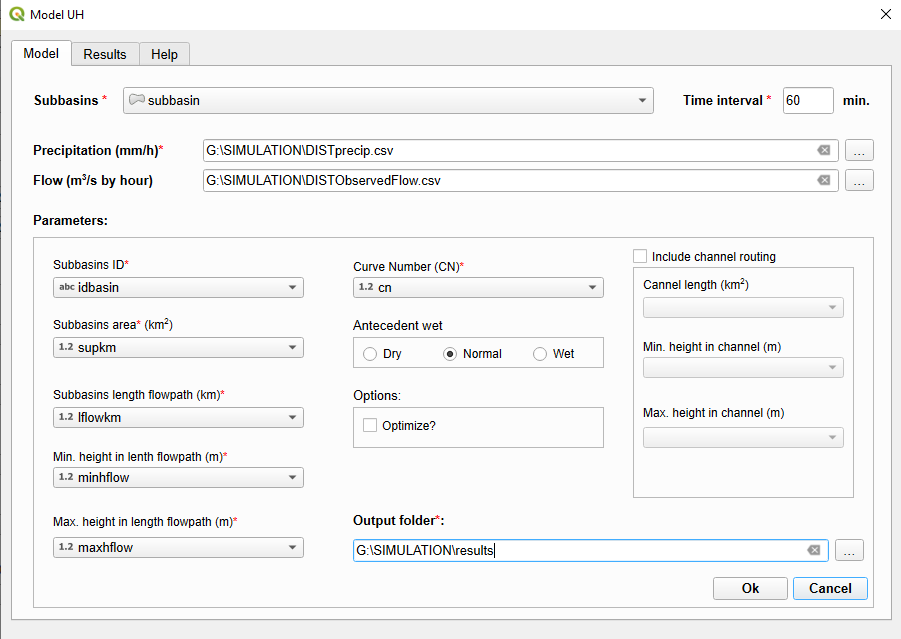

# hidroUH

Plugin de QGIS que permite estimar el caudal superficial generado por un evento de precipitación a nivel de cuenca (de forma agregada o mediante la esquematización de la cuenca en subcuencas). Para ello, utiliza el método del número del curva (CN) del Soil Conservation Service (SCS) para aproximar la fase de pérdidas (separación entre la Precipitación Neta (Pn) y la precipitación que no genera escorrentía superficial), el hidrograma unitario del SCS para conversión lluvia-escorrentía y el méteodo de Múskingum para la translación en cauce.

To report failures or make suggestions, please contact [fjgomariz@um.es](mailto:fjgomariz@um.es  "fjgomariz@um.es ") 

**Acknowledgments**: This work was supported by the Spanish Agencia Estatal de Investigación (Grant number TED2021-131131B-I00).

- **Autores**: [Francisco Gomariz-Castillo](), [Francisco Alonso-Sarría](https://github.com/pacoalonso/), Gabriel Molina-Pérez y Carmen Valdivieso-Ros
- **Version**: 0.1
- **Fecha**: 30 de Mayo de e2025

## 1. Plugin installation and requirements

Para instalar el plugin se debe descargar en formato zip desde este repositorio, tras lo cuál se instalará en QGIS a través del menú *Plugin -> Manage and Install Plugin ...* Una vez dentro de la ventana de gestión de plugin, se instalará con la opción *Install from ZIP*.

Tras su instalación se puede acceder a través del menú Plugin (Fig.1) o con el botón de la barra de herramientas 

###Requeriments

## 2. Using plugin

La interfaz de usuario del plugin se divide en tres secciones: Model, donde se introducen los datos de entrada requeridos para su ejecución, Results, que muestra un resumen de los resultados (los resultados de detalle se generarán en el directorio de salida del plugin), y Help, con una manual de ayuda. 

### 2.1. Model (input data)

En la primera pestaña (Fig.1) se deben introducir los datos de entrada (el  * indica que son necesarios, mientras que el resto son optativos).

Los archivos de entrada con datos en forma de capa vectorial y/o serie temporal son:

- **Subbasins**: Layer tipo polígono cargado previamente en QGIS de la cuenca (o subcuencas). En esta capa se incluirán os parámetros en forma de columna, representando las características de éstas. Los elementos tipo *ComboBox* (listas deplegables) de la zona *Parameters* representan el nombre de las columnas que se introducirán como parámetros del modelo.
- **Precipitation (mm/h)**: Archivo tipo csv con la precipitación de entrada. El formato que debe tener es: Una primera columna almacenando la fecha y hora, y tantas columnas como subcuencas se quieran incluir en el modelo, incluyendo como nombre de ésta el código de la cuenca o subcuenca. El separador de columnas será *comma* y el símbolo decimal *point*. Con el objetivo de simplificar el objetivo, en este archivo se incluirá un hietograma asociado a cada subcuenca, que puede ser obtenido a partir de la estación meteorológica más  cercana a ella, como una serie promedio obtenida de forma externa a partir de varios pluviógrafos o como una serie promedio obtenida a partir de datos en malla.
- **Flow (m3/s by hour)**: Archivo en formato csv (con las mismas especificaciones del anterior) que almacena el caudal observado en la desembocadura de la cuenca. Si se incluye este archivo el plugin estimará la bondad de ajuste entre la simulación y el caudal observado y, en caso de activar el check box **Optimize?** realizar su calibración.

En cuanto a los parámetros requeridos, se incluyen los siguientes:

- **Subbasins ID**: Identificador (numérico o tipo texto) de cada subcuenca.
- **Subbasins area (km2)**: Superficie de la subcuenca (km2).
- **Subbasins length flowpath (km)**: Longitud (km) de la línea de flujo máxima (o en su defecto del cauce principal) de la subuenca.
- **Min. height in lenth flowpath (m)** and **Max. height in length flowpath (m)**: Altitud máxima y mínima, expresada en metros, de la línea de flujo máxima (o en su defecto del cauce principal) de la subcuenca. Deben considerarse como la cota del final y del principio de dicha línea.
- **Curve Number (CN)**: Valor del número de curva medio de la subcuenca.
- **Antecedent wet** radio buttons: Opción que sirve para corregir el número de curva en función de las condiciones antecedentes de humedad en el suelo (por defecto se marca la opción *Normal*, que suele corresponder con los valores tabulados de número de curva y capas espaciales existentes).
- **Include channel routing** ckeck button: En caso de existir más de una subcuenca, esta opción sirve para indicar al plugin si se va a computar la translación en cauce; se debe tener en cuenta que la translación se producirá en las subsiguientes subcuencas aguas abajo de las subcuencas de cabecera, obteniendo como caudal final en sus salidas la suma del caudal generado en la subcuenca por la que transita más el caudal que llega tras transitar por el cauce considerado. Los parámetros a incluir en este caso son:
	- **Channel length (km)**: Longitud, expresada en km, del cauce asociado a la subcuenca por la que transitará el hidrograma que entra aguas arriba de la subcuenca.
	- **Min. height in channel (m)** and **Max. height in channel (m)**: Altitud máxima y mínima, expresada en metros, asociada a al cauce, considerara estas cotas las asociadas al final y al principio de dicho cauce. 

- **Output folder**: Directorio de salida en la que se almacenerá la información de detalle generada por el modelo (ver siguiente apartado).

### 2.2. Results

El plugin generará dos tipos de resultados: los incluidos en la pestaña **Results** y los que se generan y almacenan en el **Output folder**.

### 2.2.1. Pestaña *Results*

En esta pestaña se incluyen resultados de resumen para el conjunto de la simulación **TERMINAR**

### 2.2.2. Directorio *Output folder*

En este directorio se almacenan los resultados de detalle (gráficos y datos tabulares). Por un lado alamcenará dos tipos de gráficos:

- **Fase de pérdidas: método del número de curva del SCS**: Se generará un gráfico por cada subcuenca representando el hietograma asociado al evento y su división en tres partes: (i) precipitación efectiva o neta, que generaría escorrentía superficial (Pe), en color azul, y las pérdidas o infiltración, divididas en  (ii) infiltración inicial antes de producirse escorrentía (abstracción inicial - Ia) en color rojo y (iii) la infiltración acumulada (infiltración que se produce al tiempo que se produce - Fa) en color verde. Además incluye un cuadro resumen para la subcuenca con los totales acumulados para el evento, incluyendo la precipitación total (P). En la siguiente figura se muestra un ejemplo.

- **Fase de transformación de lluvia-escorrentía: método del hidrograma unitario del SCS**: En este gráfico se resume para cada subcuenca el hidrograma de caudal asociado a su salida. En el caso de simulaciones para una sola cuenca, o para la subcuenca de salida en el caso de simulaciones con más de una subcuenca, si se ha incluido un archivo de caudal observado, se incluyen los hidrogramas de caudal simulado (en color azul) y observado (en color negro); en la siguiente figura se incluye un ejemplo.

Añadido a estos gráficos, se generan dos archivos tabulares que almacenan los resultados numéricos:

- **model_results.csv**: asdg

- **model_resum.csv**: sadg

## 3. Methods

**hydroUH** es un plugin que permite aproximar mediante ecuaciones simples el comportamiento de un evento en lo relativo a la escorrentía directa que puede generar. Para ello, conceptualiza el sistema cuenca a partir de las fases descritas en los siguientes subapartados para cada subcuenca, de forma que el caudal que se vaya generando en cada subcuenca aguas arriba actuará como entrada en la subcuenca que tenga conectada aguas abajo. Puede por tanto concebirse como una implementación en red de una cuenca a partir de su división en recintos (subcuencas) que se conectan entre si desde aguas arriba (cuencas de cabecera para las que se implementan las ecuaciones de pérdidas y conversión lluvia-escorrentía a partir de modelos espacialmente agregados) con las subcuencas o recintos aguas abajo; la aproximación en este tipo de subcuencas o recintos se realizará de forma similar a las subcuencas de cabecera, pero además, el hidrograma simulado aguas arriba pasará a ser una entrada, simulándose su translación en el cauce hasta que, al llegar a la desembocadura, se sumará al hidrograma generado en la propia subcuenca.

Implementar este tipo de modelos permite una aproximación semidistribuida en el espacio a partir de los recintos, aproximando mejor la heterogeneidad espacial de aspectos como los usos del suelo, tipos de suelo o el propio evento, pero utilizando ecuaciones para modelos simples espacialmente agregados. En la siguiente figura se incluye a modo de ejemplo un
 esquema de una cuenca (Rambla de Parriel, ubicada en la Región de Murcia, al sureste de España) con tres subcuencas o recintos, las lineas de flujo máximo que caracteriza a cada una de ellas, y el cauce para el que se estimará la translación del hidrograma procedente de las dos subcuencas de cabecera a la cuenca *C3*, que es el recinto al que se le asocia la salida de la cuenca.

### 3.1. Loss

El *número de curva* del **METE REFERENCIA** es un método simple que permite separar de un hietograma de precipitación aquella parte que generará escorrentía directa, denominada precipitación eficaz o neta (Pe). Ha sido muy utilizado para estudiar episodios lluviosos en cuencas donde no se dispone de medidas de infiltración. Se basa en un parámetro denominado *Infiltración Potencial Máxima (S)* que se calcula con la ecuación $ S = \frac{25400}{NC} - 254$

### 3.2. Transform

### 3.3. Routing

## References

### License

[hydroUH](https://github.com/fdfsfjgomariz/hidroUH) © 2025 by [Francisco Gomariz-Castillo](https://portalinvestigacion.um.es/investigadores/333183/detalle) is licensed under [CC BY-NC 4.0](https://creativecommons.org/licenses/by-nc/4.0/)
